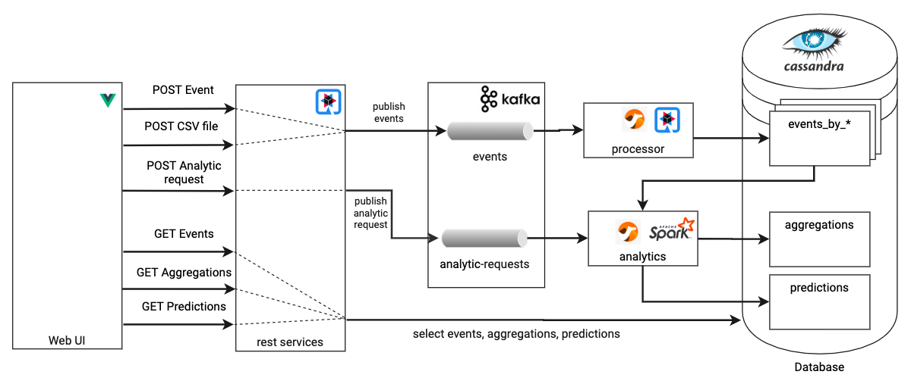
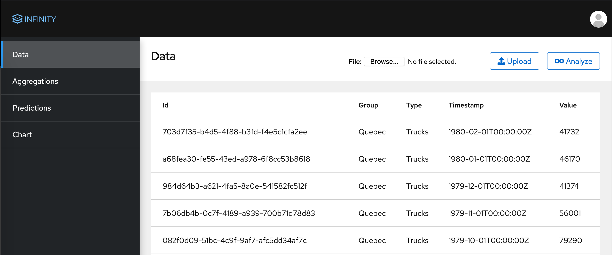
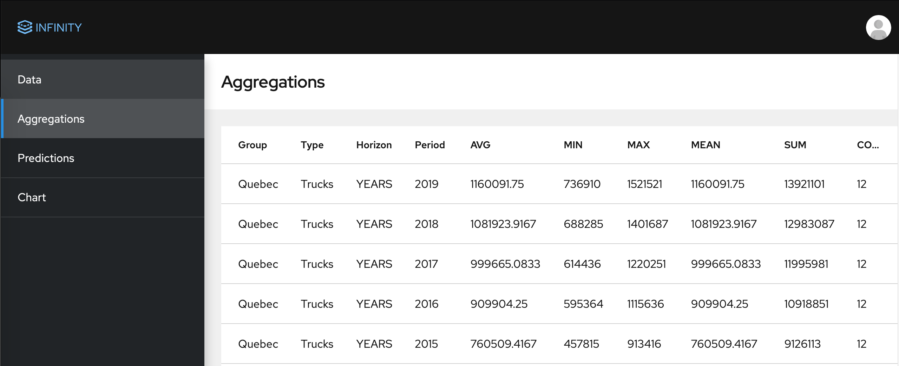

# Infinity


Infinity is a prototype of cloud-agnostic forecasting platform inspired by Amazon Forecast service.   
Project was created as a part of the [ASTRAKATHON](https://github.com/DataStax-Academy/cassandra-workshop-series/blob/master/week4-AppDev-api/HACKATHON.MD) organized by DataStax.

 
## Requirements
- User should be able to upload dataset file
- User should be able to publish events through an API
- User should be able to view uploaded data
- User should be able to start analysis (aggregations and predictions)
- User should be able to view aggregations and predictions as tables and charts 
- System should store events permanently
- System should store aggregations permanently
- System should store predictions permanently
- System should be horizontally scalable


 

## Architecture


### Components
#### WebUI
Demo application to present results (infinity-rest).  
User could upload CSV files with data for analysis and check results.  
Implemented with Vue.js and Chart.js. See [screenshots](#user-interface). 

#### REST services
API to interact with the system (infinity-rest).   
Implemented with Quarkus and Cassandra extension.

#### Processor
Data processing application (infinity-processor).  
Includes three consumer groups to retrieve events from Kafka and store into Cassandra tables.  
Implemented with Quarkus and Apache Camel.

#### Analytics
Data analytics application (infinity-analytics)  
Aggregates events by SECOND, MINUTE, HOUR, DAY, MONTH and YEAR  
and calculate AVG, MIN, MAX, MEAN, SUM, COUNT for event values.  

Forecast values for aggregated values for all horizons.  
Current version provides predictions with ARIMA algorithm for six steps.  
Implemented with Spark and Apache Camel.

#### Kafka
Event store in CQRS architecture  

#### Cassandra
Database for events, aggregations and predictions.  
Tables:
- EVENTS_BY_ID
- EVENTS_BY_TIMESTAMP
- EVENTS_BY_TIME
- AGGREGATIONS
- PREDICTIONS

#### Init
Init container to create Cassandra keyspace and tables (infinity-init)

## Build and run
Requires Git, Docker and Docker Compose installed.
```
git clone git@github.com:mgubaidullin/infinity.git
docker-compose build
docker-compose up
```
Application is ready to use after following line in the log: `infinity-init exited with code 0`  

## Execute

### User Interface
Open following link in browser `http://localhost:8080`

#### Upload data
- Select file (quebec.csv) and click 'Upload' button


- Refresh page to review results (processing might take 5 seconds)



- Click 'Analyze' button to start aggregation and forecast
- Go to Aggregations page to review aggregation results (analysis might take 20 seconds)



- Go to Predictions page to review predictions results


- Go to Chart page to compare facts and forecast


### Command line
Upload file with events
```
curl -i -X POST -H "Content-Type: multipart/form-data" -F "file=@quebec.csv" http://localhost:8080/file
```
Start analytics for special event group and type
```
curl -X POST "http://0.0.0.0:8080/analytic" -H  "accept: application/json" -H  "Content-Type: application/json" -d "{\"eventGroup\":\"Quebec\",\"eventType\":\"Trucks\"}"
```
Retrieve aggregations
```
curl -X GET "http://0.0.0.0:8080/analytic/aggregation/Quebec/Trucks/YEARS/2020" -H  "accept: application/json"
```
Retrieve predictions
```
curl -X GET "http://0.0.0.0:8080/analytic/prediction/Quebec/Trucks/ARIMA/YEARS/2025" -H  "accept: application/json"
```

### Swagger
Swagger UI for API `http://localhost:8080/swagger-ui`
